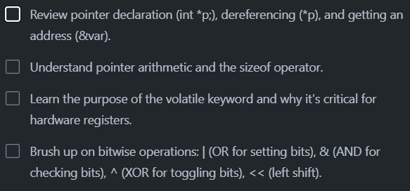
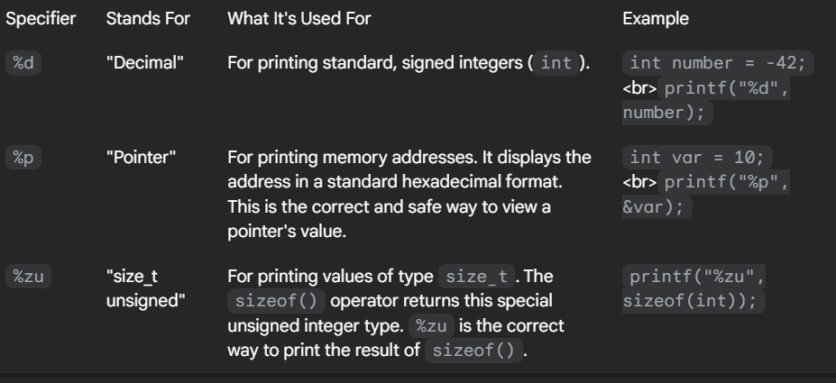

 - THIS WEEK'S C-PROGRAMMING TASKS

1. & - operator gets the address of the variable
2. * - operator declares the pointer, when again called after declaring gives the value inside the pointer, can also used to edit the contents of the variable

  - FORMAT SPECIFIERS %d, %p, %zu